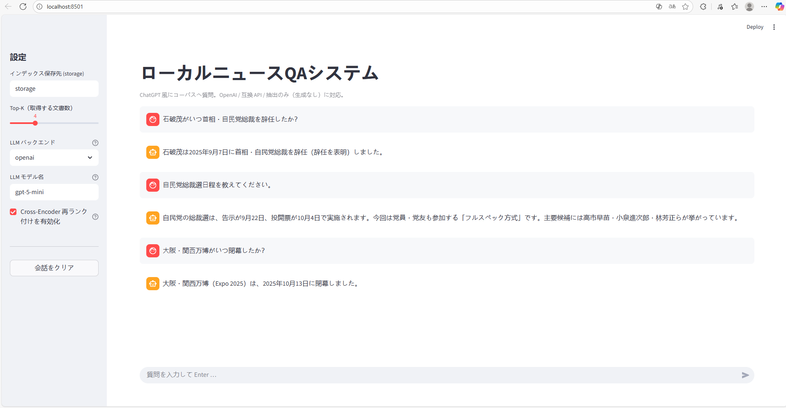
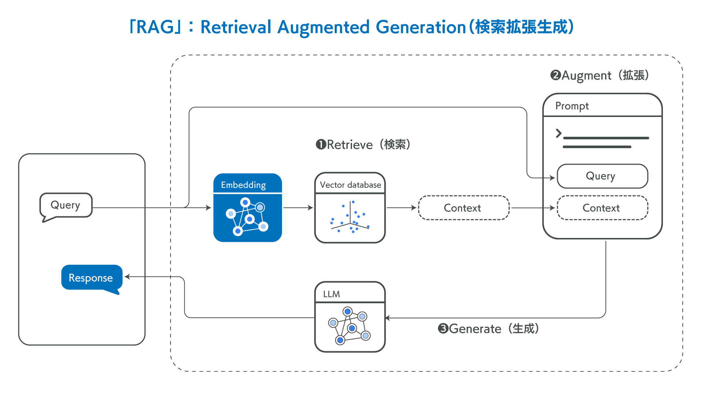
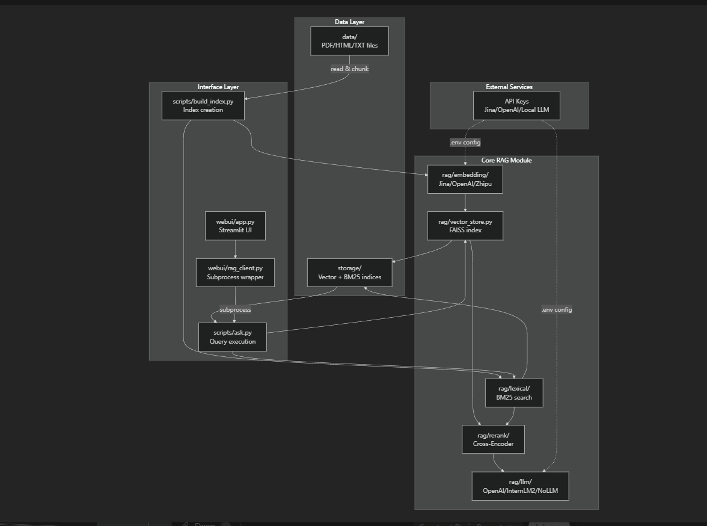
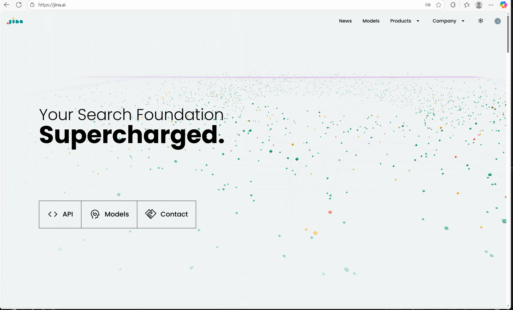
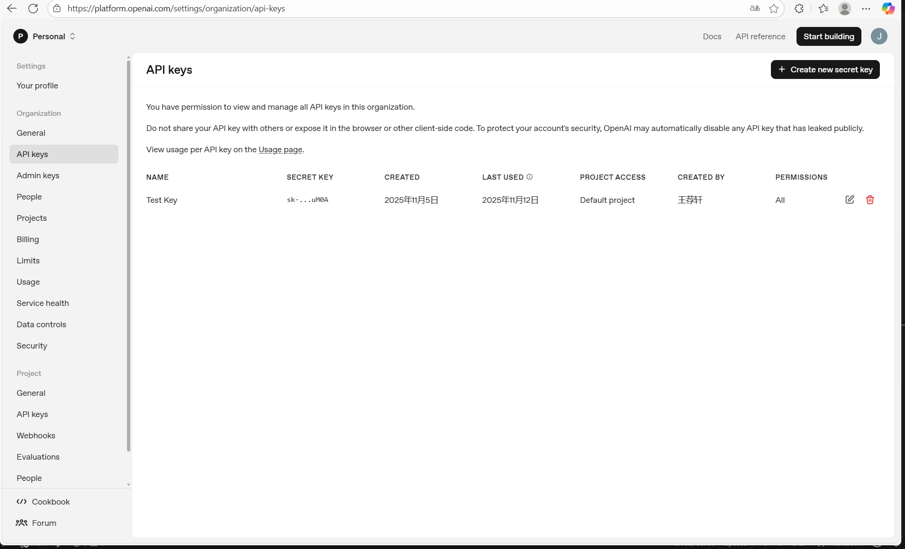
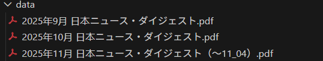

# ローカルニュースのQAシステム

# はじめに
## 1. 概要
本プロジェクトでは、OpenAIが提供するLLMモデルを利用した、ローカルニュースのQAシステムを構築した。このシステムは、ユーザーがニュースに関する質問を入力すると、RAG技術を活用して関連情報を検索し、適切な回答を生成できた。

<div align="left">
    
</div>

## 2. RAGについて
RAG（Retrieval-Augmented Generation）は、検索エンジンや情報検索技術を統合した生成型AIの一種である。大規模言語モデル（LLM）と外部データベースを統合し、質問に対するより正確かつ最新の回答を生成する仕組みを提供する。以下に、RAGの基本的な概念を紹介する：

### RAGの仕組み
RAGは主に以下の3つのステップで構成される。
1. Retrieve（検索）:
   ユーザーの質問（Query）を基として、データベースから関連情報を検索する。

2. Augment（補完・拡張）:
	• 検索結果をもとにコンテキスト情報を生成する。
	• 検索したデータをプロンプトとして言語モデルに渡すことで、回答生成に必要な情報を補完する。

3. Generate（生成）:
	• 言語モデルが検索データを利用して回答を生成する。
	• 外部データベースから得た情報を活用することで、モデルが学習していない新しい情報を含めた回答が可能。

### RAGの流れ

<div align="left">
    
</div>
出典：https://blog-ja.allganize.ai/allganize_rag-1/

## 3. 本プロジェクトの構造

<div align="left">
    
</div>

# 環境のセットアップ

## 1. 仮想環境の構築
本プロジェクトは、python3.11の仮想環境で動作した。以下のコマンドでプロジェクトフォルダの直下に仮想環境を有効にした。
```bash
py -3.11 -m venv .venv
Set-ExecutionPolicy -Scope Process Bypass
.\.venv\Scripts\Activate.ps1
```
## 2. ライブラリのインストール
```bash
python -m pip install --upgrade pip
pip install -r requirements.txt
```

## 3. API keyの準備

Jina AIのAPIキーは無料のお試し回数を提供しているので、本プロジェクトは、データのベクトル化およびインデックス生成はJina AIのAPIキーを利用した。
<div align="left">
    
</div>

LLMは、従量課金制のopenAIのAPIキーを利用した。

<div align="left">
    
</div>

## 4. データの配置
プロジェクト直下のdataフォルダにカスタマイズデータを配置した。本プロジェクトは、日本の月次ニュースを配置した。

<div align="left">
    
</div>

# 実装の詳細

本プロジェクトのレポジトリ構成は以下となる。
  ```text
  RAG/
  ├─ data/                  # 検索対象のデータ（PDF/HTML/TXT など）
  ├─ storage/               # ベクトル索引（自動生成）
  ├─ webui/                 # システムUI
      ├─ app.py             # フロントのソースコード
      └─ rag_client.py      # ask.pyの呼び出し
  ├─ rag/
  │   ├─ embedding/         # Jina / OpenAI / Zhipu の埋め込み実装
  │   ├─ llm/               # OpenAI, InternLM2(互換API), NoLLM
  │   ├─ lexical/           # BM25（キーワード検索）
  │   ├─ rerank/            # Cross-Encoder 再ランク（任意）
  │   └─ vector_store.py
  └─ scripts/
      ├─ build_index.py     # 索引の作成
      └─ ask.py             # 検索→（任意で再ランク）→生成で回答
 ```

# 回答生成までの流れ

本プロジェクトの回答生成までの流れは、以下のステップで実現した。

### 1.　Embedding＋ベクトル索引作成
#### ①ドキュメント収集・チャンク化
- data/配下のPDF/HTML/TXTを再帰的に走査し、パーサでテキストを抽出したあと、文単位または固定長＋オーバーラップでチャンク（テキスト断片） に分割する。
#### ②Jina APIによる埋め込み（Embedding）
- 各チャンクをrag/embedding/モジュール経由でJinaの埋め込みAPI（例：--embed-backend jina, --embed-model jina-embeddings-v3）に送信し、テキストを高次元ベクトル（embedding）に変換する。
#### ③ベクトル索引（Vector Index）の作成・保存
- 得られたベクトルと、元テキスト・ファイルパス・ページ番号などのメタ情報をひとまとめにしてベクトル索引として構造化し、storage/ ディレクトリに保存する。
### 2. BM25＋ベクトル混合検索
#### ①BM25 によるキーワード検索
- ユーザーの質問文（クエリ）をBM25検索エンジンに渡す。
- 単語頻度・逆文書頻度などに基づいてBM25スコアを計算する。
- キーワードマッチの高いチャンク候補を取得する。
#### ②ベクトル検索（Embedding 検索）
- 同じクエリ文を埋め込みモデルでベクトル化をする。
- 先ほど作成したベクトル索引からクエリベクトルと距離（類似度）が近いチャンクを取得する。
#### ③スコアの混合（Hybrid Search）
- BM25とベクトル検索で得た候補をチャンクID単位でマージする。
- 各スコアを正規化したうえで、--bm25-weight/--vec-weight で指定された重みに従って、
最終スコア = BM25 スコア × w_bm25 ＋ ベクトルスコア × w_vec
で計算する。
- 最終スコアの降順にソートし、上位K件を「混合検索結果」として採用する。
### 3. 再ランキング（Rerank）
#### ①候補チャンクの再評価
- 混合検索で得られた上位K件（例：50〜100 件）の「クエリ＋チャンク」のペアを、Cross-Encoder等の再ランキングモデルに渡す。
#### ②関連度スコアの算出
- 各ペアについて「このチャンクがクエリにどれだけ関連しているか」をスコアとして算出する。
#### ③最終順位付け
- このスコアに基づき候補を再ソートし、上位N件（例：3〜5 件）を 最終コンテキスト候補として採用する。
### 4. 回答生成（LLM/No LLM）
#### ①No LLM モード
- 再ランキング後の上位チャンクをそのまま列挙してユーザーに提示し、あるいはシンプルなルールで要約・抽出して簡潔な回答を返す。
#### ②LLM 使用モード
- 再ランキング後の上位チャンクをコンテキストとして LLM（OpenAI/ローカルLLM 等）に渡す。
- 「これらのチャンクに基づいて回答を生成してください」というプロンプトを構成して自然言語の最終回答を生成する。
